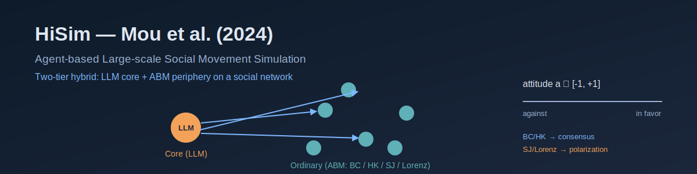

<p align="center"></p>

[English](README.md) | **日本語**

# HiSim: 大規模社会運動シミュレーションに向けて — Mou et al. (2024)

Mou, Wei & Huang (2024)「Unveiling the Truth and Facilitating Change: Towards Agent-based Large-scale Social Movement Simulation」(Findings of ACL 2024; arXiv:2402.16333) のフレームワーク **HiSim** の再現実装．HiSim はトリガーイベント後にソーシャルメディア上で集合的意見がどう変化するかを予測する．ユーザを **2 階層** に分け，活発で影響力のある少数の **コア** ユーザを LLM で駆動し (profile/memory → LLM が行動 post/retweet/reply/like/do-nothing を選択 → stance/sentiment postprocessing で態度を更新)，沈黙する多数派である **一般 (ordinary)** ユーザを決定論的な **意見力学 ABM** (Bounded Confidence・HK・Social Judgement・Lorenz) で駆動する．結合は **一方向**: コア → 一般の影響のみを考慮し，逆方向は微小として無視する．両階層は 1 つの社会ネットワーク (既定 Barabási–Albert) 上に置かれ，全エージェントは連続態度 `a ∈ [-1, 1]` を持つ．

決定論的な [socsim](https://github.com/akitenkrad/rs-social-simulation-tools) コアが網生成・階層割当・一般層 ABM 更新・スケジューラ・指標を担い，非決定的な LLM レイヤは 1 つのメカニズムに閉じ込め，`socsim-llm` クレートで擬似決定論化する (プロンプト→応答キャッシュ + `temperature=0` + 固定 seed)．`--core-ratio 0.0` なら LLM 呼び出しは **一切なく**，完全に決定論的な純粋 ABM ベースラインになる．

## 二層決定論 (最初に読む)

LLM の出力は socsim の bit 再現性の **外側** にある．したがって設計は二層に分かれる:

- **決定論的 socsim コア** — 網生成 (BA / WS / ER)・階層割当 (高次数ノードがコアに)・一般層 ABM 意見力学 (ステップ開始時の態度スナップショットからの同期更新)・スケジューラ・指標．seed を与えれば bit 単位で再現する．
- **非決定的 LLM レイヤ** — コア層の行動選択．`socsim-llm` の `CachingClient` (`hash(prompt+model)` → 応答キャッシュ)・`temperature=0`・固定 seed で擬似決定論化する．プロバイダ順は `socsim-llm` の `FallbackClient` により **Ollama 第一 → OpenAI フォールバック**．

再現性を担うのはモデルではなく**キャッシュ**である: ウォームキャッシュは同一応答を再生するため，再実行はコスト 0 で安定する．各実行は `run_metadata.json` にプロバイダ・モデル・endpoint・温度・seed・core-ratio・cache-hit 率を記録する．ローカル既定モデル (`llama3.2:latest`) は論文の GPT-3.5 と異なるため，再現目標は**定性的** (傾向と符号: ハイブリッドが純粋 ABM のトレンドを補正・BC/HK は合意へ収束・SJ/Lorenz は二極化・BA はコア影響を増幅) であり，論文の数値完全一致は狙わない．

## 2 階層ハイブリッド

HiSim の核心は **規模** (数百万ユーザ) と **忠実度** (LLM の豊かな挙動) の両立である．数千の LLM を回すのは非現実的なので，影響力のある少数 = **コア** のみを LLM 駆動とし，沈黙する多数派 = **一般** 層は軽量な決定論的 ABM で近似する．これはソーシャルメディアのエンゲージメントが従う Pareto 分布 (少数のアクティブユーザが大半のコンテンツを生む) と整合する．較正は論文に倣い，純粋 ABM (`--core-ratio 0.0`) パスで ABM パラメータを調整してからハイブリッドへ適用する (較正中に数百回の LLM 呼び出しを回避)．

## インストールとクイックスタート

```bash
# Rust シミュレーションのビルド (socsim を取得; socsim-llm の Ollama+OpenAI バックエンド込み)
cargo build --release

# === 純粋 ABM ベースライン (LLM 不要) ===
cargo run --release -- run \
    --dataset metoo --abm bc --core-ratio 0.0 \
    --n-agents 1000 --steps 14 --network ba --seed 42

# === ハイブリッド (LLM コア + ABM 周辺) — ローカル Ollama が必要 ===
#   ollama pull llama3.2:latest
OLLAMA_HOST=http://localhost:11434 OLLAMA_MODEL=llama3.2:latest \
cargo run --release -- run \
    --dataset metoo --abm bc --core-ratio 0.3 \
    --n-agents 1000 --steps 14 --network ba \
    --llm-temperature 0 --seed 42
# 同一引数で再実行 → cache-hit 100% (LLM 非呼び出し)

# === 感度分析スイープ (core-ratio × abm × network) ===
cargo run --release -- sweep \
    --core-ratio-min 0.0 --core-ratio-max 0.5 --core-ratio-step 0.1 \
    --abm-values bc,hk,sj,lorenz --network-values ba --runs 10 --seed 42

# === 論文再現 (Table 2/3 + SoMoSiMu-Bench) ===
#   ハイブリッド vs 純 ABM の対比 + bench 照合; --mock = 完全オフライン (ライブ LLM 不要)
cargo run --release -- reproduce --mock --seed 42

# === 外部 LLM stance 注釈 (オプトイン; ライブバックエンドが必要) ===
#   既定のキーワード分類器はビット等価．`--stance-annotator llm` は
#   コア LLM に各 post の stance を 5 段階で答えさせる．
OLLAMA_MODEL=llama3.2:latest cargo run --release -- run \
    --core-ratio 0.3 --abm bc --stance-annotator llm --seed 42

# === 可視化 ===
uv sync
uv run hisim-tools visualize
uv run hisim-tools visualize-sweep
uv run hisim-tools show-experiment-settings --results-dir results/latest
uv run hisim-tools reproduce --run --mock          # reproduce レポート + 図，オフライン

# === オフライン (LLM 不要) スモーク: scripted mock 経由でハイブリッド経路を実行 ===
cargo run --release --example mock_smoke -- results
```

## 出力

各 `run` は `results/{timestamp}/` (および `latest` シンボリックリンク) に書き出す:

- `metrics.csv` — long-format `t, metric, value`．`macro_bias` (平均態度)・`macro_diversity` (分散)・`mobilized` (しきい値超過数)・`polarization` (双峰度)・`core_influence` (コア層平均態度)・`llm_actions`．
- `config.json` — 解決済みの実行設定．
- `run_metadata.json` — LLM プロバイダ / モデル / endpoint / 温度 / seed / core-ratio / cache-hit 率．

各 `sweep` は `results/{timestamp}_sweep/` に `sweep_summary.csv` と `sweep_config.json` を書き出す．

各 `reproduce` は `results/reproduce_{timestamp}/` に `reproduce_summary.json` (Table 3 の hybrid vs 純 ABM 行列・SoMoSiMu-Bench 照合・観測 vs 論文のアンカーと PASS/off 帯)・条件別 `metrics_<label>.csv` を書き出し，`hisim-tools reproduce` 経由で `figures/{table3_hybrid_vs_pureabm,bench_alignment,mobilization_curves}.png` を生成する．SoMoSiMu-Bench 参照は **較正済み合成**曲線であり生ベンチマークデータではない ([アーキテクチャ](docs/architecture.ja.md) 参照)．

## ドキュメント

- [アーキテクチャ](docs/architecture.ja.md) — リポジトリ構成・`HiSimWorld` の 2 階層状態・4 メカニズム・ABM 数式・stance 注釈・SoMoSiMu-Bench 照合・`reproduce`．
- [CLI リファレンス](docs/cli.ja.md) — `run` / `sweep` / `reproduce` の全フラグ．
- [ユースケース](docs/usecases.ja.md) — 純粋 ABM ベースライン・ハイブリッド・感度分析・論文再現．
- [可視化](docs/visualization.ja.md) — Python ツール．

## 参考文献

- Mou, X., Wei, Z., & Huang, X. (2024). Unveiling the Truth and Facilitating Change: Towards Agent-based Large-scale Social Movement Simulation. *Findings of ACL 2024*, 4789–4809.
- Deffuant, G., et al. (2000). Mixing Beliefs among Interacting Agents. (Bounded Confidence)
- Hegselmann, R., & Krause, U. (2002). Opinion Dynamics and Bounded Confidence (HK).
- Lorenz, J., et al. (2021). A Model of Opinion Dynamics with Assimilation, Reinforcement, and Polarization.

## ライセンス

MIT — [LICENSE](LICENSE) を参照．

---
*This file was generated by Claude Code.*
